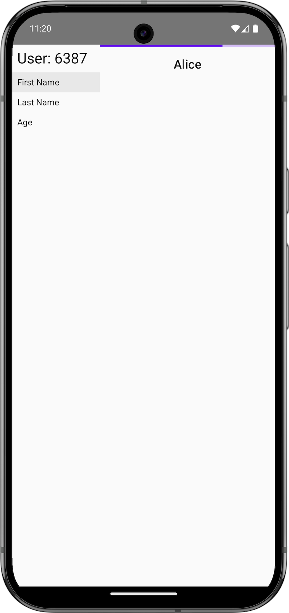
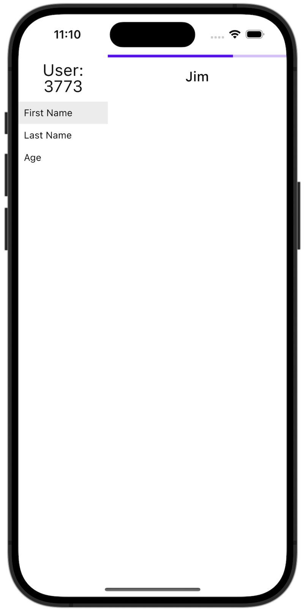

---
social:
  cards_layout_options:
    title: Application framework for KMP
---

# App Platform

## Introduction

{ align=left width="150"  }

The App Platform is a lightweight application framework for state and memory management suitable
for Kotlin Multiplatform projects, in particular Android, iOS, JVM, native and Web (1). It makes the
dependency inversion (2) and dependency injection (DI) design patterns first class principles to develop
features and support the variety of platforms. The UI layer is entirely decoupled from the business logic,
which allows different application targets to change the look and feel.
{ .annotate }

1.  Web support is still in development.
2.  Dependency inversion means that high-level APIs don’t depend on low-level details and low-level details only import other high-level APIs.

App Platform pushes for code reuse by sharing APIs and implementations, while making it easy to leverage
platform strengths and changing app or device specific behavior when needed. The framework helps you to get started
writing Kotlin Multiplatform effectively.

=== "Android"
    { width="300" }

=== "iOS"
    { width="300" }

=== "Desktop"
    { width="300" }

## Overview

App Platform is built on top of several other frameworks. While all of them are optional, they help significantly
to recommended best practices.

### Module Structure

The [module structure](module-structure.md) helps to separate APIs from implementations. This prevents leaking
implementation details, forces developers to think about strong APIs and reduces build times. Checks for the correct
usage of the module structure are implemented in the Gradle plugin.

### Dependency Injection

App Platform uses by default [kotlin-inject-anvil](di.md) for dependency
injection. But this isn't enforced and can be changed (1).
{ .annotate }

1.  In the very first versions of App Platform, we at Amazon used [Dagger 2](https://dagger.dev/) and
[Anvil](https://github.com/square/anvil). Later we migrated to [kotlin-inject-anvil](https://github.com/amzn/kotlin-inject-anvil).

### Scopes

[`Scopes`](scope.md) are essential in our architecture. They define the boundary our software components
operate in. A scope is a space with a well-defined lifecycle that can be created and torn down. App Platform
provides hooks to create your own scopes with easy callbacks, integration for dependency injection
frameworks and `CoroutineScopes`.

### Presenters

[Presenters](presenter.md) are implemented using [Molecule](https://github.com/cashapp/molecule). Writing business and
navigation logic using *Compose* is significantly easier than chaining `Flows`.

### UI

The UI layer is fully decoupled using [Renderers](renderer.md). [Compose Multiplatform](https://www.jetbrains.com/compose-multiplatform/)
is fully supported out of the box. For Android there is seamless interop with Android `Views` (1).
{ .annotate }

1.  We have a mix of both UI frameworks on Android.

### Testing

Fakes for unit and device tests are essential and integral part of our architecture. There are many
[test helpers](testing.md) to setup fakes for core components such as `Scopes`. We like using
[Turbine](https://github.com/cashapp/turbine/) for verifying the reactive behavior of our `Presenters`.
Thanks to *Compose Multiplatform*, `Renderers` [can be tested](renderer.md#unit-tests) in isolation for iOS
and Desktop.

### Integration

The [Gradle plugin](setup.md) comes with a convenient DSL to take care of many necessary configurations, e.g. it sets
up the *Compose* compiler for *Molecule* and *Compose Multiplatform*. It configures KSP and integrates
*kotlin-inject-anvil* for each platform. It sets the Android namespace and artifact ID when the module
structure is enabled.

## License

```
Copyright Amazon.com, Inc. or its affiliates. All Rights Reserved.

Licensed under the Apache License, Version 2.0 (the "License");
you may not use this file except in compliance with the License.
You may obtain a copy of the License at

   https://www.apache.org/licenses/LICENSE-2.0

Unless required by applicable law or agreed to in writing, software
distributed under the License is distributed on an "AS IS" BASIS,
WITHOUT WARRANTIES OR CONDITIONS OF ANY KIND, either express or implied.
See the License for the specific language governing permissions and
limitations under the License.
```
