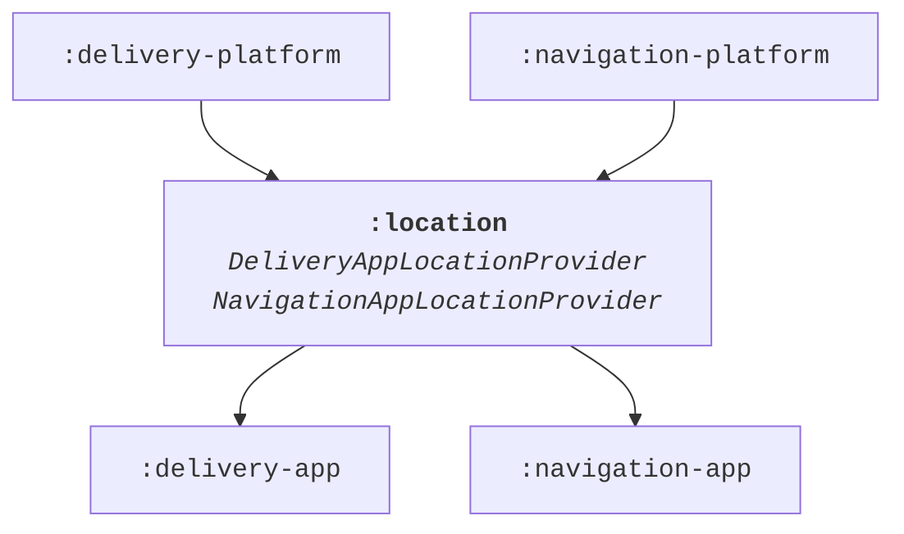
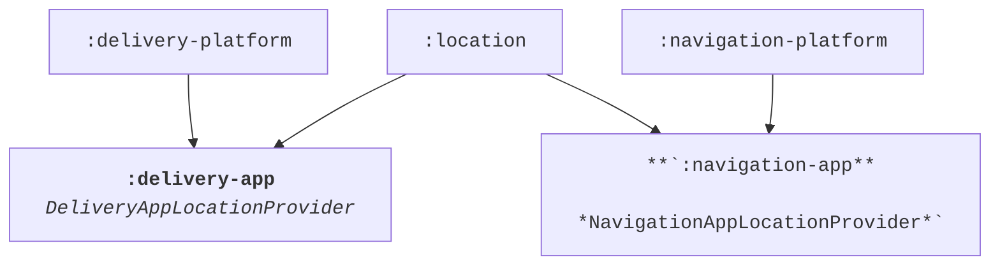
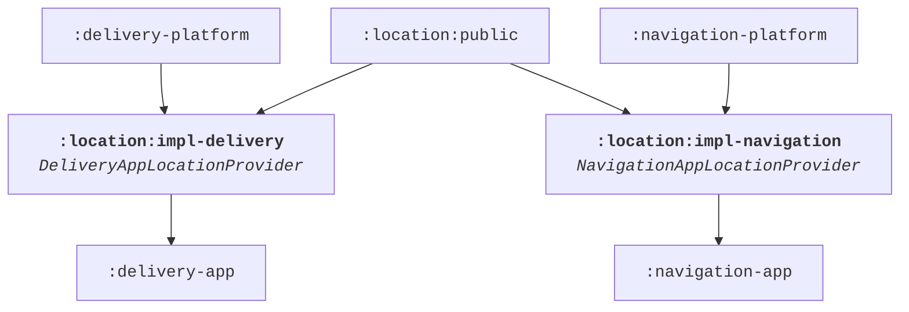

# Module Structure

!!! note

    Using the module structure is an opt-in feature through the Gradle DSL. The default value is `false` and
    this feature has to be enabled for each module.
    ```groovy
    appPlatform {
      enableModuleStructure true
    }
    ```

!!! tip

    [`:impl`](module-structure.md#impl) modules are usually imported by the final [`:app`](module-structure.md#app)
    modules. This also applies to App Platform itself. This Gradle option imports all necessary `:impl` modules for
    enabled features.
    ```groovy
    appPlatform {
      addImplModuleDependencies true
    }
    ```

!!! example "Sample"

    App Platform itself and the [sample app](https://github.com/amzn/app-platform/tree/main/sample) use the module
    structure to separate APIs from implementations. The sample app highlights how we structure code and make use
    of the various module types.

## Dependency inversion

Dependency inversion means that high-level APIs don’t depend on low-level details and low-level details
only import other high-level APIs. It significantly reduces coupling between components. Dependency
inversion can be implemented on different levels, e.g. in code and in the module structure.

### Kotlin code

Dependency inversion implemented in Kotlin code refers to having abstractions in place instead of
relying on concrete implementations. Imagine this example:

```kotlin
class AccountProvider(
  private val database: SqliteDatabase,
  ...
) {
  val currentAccount: StateFlow<Account> = ...

  fun updateCurrentAccount(account: Account) {
    ...
  }
}

class ChangeAccountHandler(
  private val accountProvider: AccountProvider
) {

  private fun onAccountChanged(account: Account) {
    accountProvider.updateCurrentAccount(account)
    ...
  }
}
```

`ChangeAccountHandler` has a strong dependency on `AccountProvider`. This is problematic in multiple ways.
Evolving `AccountProvider` is challenging, because implementation details are easily leaked and become
part of the public API. Every dependency from `AccountProvider` is exposed to consumers, e.g. `ChangeAccountHandler`
knows that `AccountProvider` uses Sqlite for its implementation, a detail which should be hidden and makes
dependency graphs unnecessarily large. `ChangeAccountHandler` is hard to test. One has to spin up a Sqlite database
in a unit test environment in order to instantiate `AccountProvider` and pass it as argument to
`ChangeAccountHandler`.

A much better approach is introducing abstract APIs:

```kotlin
interface AccountProvider {
  val currentAccount: StateFlow<Account>

  fun updateCurrentAccount(account: Account)
}

class SqliteAccountProvider(
  private val database: SqliteDatabase
  ...
) : AccountProvider {

  @VisibleForTesting
  val allAccounts: List<Account> = ...

  ...
}
```

The interface `AccountProvider` solves the mentioned shortcomings. `SqliteAccountProvider` can change and
for example expose more fields (`allAccounts` in this sample) for verifications in unit tests without anyone
knowing as the interface doesn’t need to be updated. Sqlite is a pure implementation detail and no consumer
of `AccountProvider` has to know about it. This allows us to easily swap the implementation for a fake
`AccountProvider` together with fake data in a unit test for `ChangeAccountHandler`.

Breaking the dependency serves an additional purpose especially in Kotlin Multiplatform when
implementations have platform dependencies:

```kotlin
// commonMain
interface SqlDriver

// androidMain
class AndroidSqlDriver(context: Context) : SqlDriver

// iosMain
class NativeSqlDriver() : SqlDriver
```

Notice how the Android implementation has a strong dependency on the Android runtime through the `Context`
class. Relying on interfaces / abstract classes together with dependency injection is the
[preferred way](https://www.jetbrains.com/help/kotlin-multiplatform-dev/multiplatform-connect-to-apis.html#dependency-injection-framework) (1)
over `expect / actual` functions to implement dependency inversion as this approach allows platform specific changes.
{ .annotate }

1.  When you use a DI framework, you inject all of the dependencies through this framework. The same logic applies to handling platform dependencies. We recommend continuing to use DI if you already have it in your project, rather than using the expected and actual functions manually. This way, you can avoid mixing two different ways of injecting dependencies.

### Gradle modules

The App Platform separates APIs from implementations by splitting the code in separate Gradle modules. The same
recommendation applies not only to other core libraries but also feature code due to the many benefits such as
smaller dependency graphs, lower coupling and a simple mechanism to replace dependencies with fakes.

Imagine having two implementations of the shared interface `LocationProvider` for two applications
*Delivery App* and *Navigation App*:

```kotlin
interface LocationProvider {
  val location: StateFlow<Location>
}

class DeliveryAppLocationProvider(
  private val dataLayer: DeliveryAppDataLayer,
  ...
) : LocationProvider {..}

class NavigationAppLocationProvider(
  private val application: NavigationApplication,
  ...
) : LocationProvider {..}
```

If both classes live in the same module, then the shared Gradle module must depend on modules belonging to
*Delivery* and *Navigation* App at the same time. This is not ideal, because then the *Delivery App* would
automatically depend on code from the *Navigation App* and the *Navigation App* on *Delivery App* code through
a transitive dependency as highlighted in the diagram below.



To avoid the issue of the transitive dependencies, concrete implementation classes `DeliveryAppLocationProvider`
and `NavigationAppLocationProvider` could be moved into the final respective application packages `:delivery-app`
and `:navigation-app`.



However, this would be a bad approach from a modularization standpoint. The app modules would become
larger and larger over time and the many classes within it would have a low cohesion level. Build times get
longer roughly linear to the size of the module, because individual build steps such as Kotlin compilation
can’t be parallelized.

Instead, a similar approach to [dependency inversion in Kotlin code](module-structure.md#kotlin-code)
is applied to modules. The shared package can be split into a public API and implementation sub-module:



By cleanly separating shared code in `:public` modules from implementations in `:impl` modules we break
dependencies in our build graph. `DeliveryAppLocationProvider` and `NavigationAppLocationProvider` provide a
separate implementation for each application target of the shared API, have dependencies on each individual
platform and yet don’t leak any implementation details nor platform APIs.

## Module rules

In order to follow the dependency inversion principle correctly the most important rule in this module structure
is that no other module but the final application module is allowed to depend on `:impl` modules. `:public`
modules on the other hand are widely shared and can be imported by any other module.

{ width="600" }

A library always comes with a single `:public` module for shared code. There can be zero, one or more `:impl`
modules, e.g. when dependency inversion isn’t needed, then the `:impl` module is redundant. When the implementation
can be shared between all apps, then only a single `:impl` module is needed. When there are multiple different
implementations for different applications, then multiple `:impl` modules are required like in the example above.
To make code easier to discover, it’s recommended to put all Gradle modules into the same sub module.

This module structure reduces coupling between libraries and increases cohesion within modules, which are two
desired attributes in a modularized codebase. `:impl` modules can change and be modified without impacting any
other library. Our build dependency graph stays flat and all `:impl` modules can be compiled and assembled in
parallel.

The `:public / :impl` module split is recommended whenever dependency inversion is needed for code, because of
all the benefits mentioned above. The split becomes more natural over time and the benefit increases. Rare
exceptions are when dependency inversion isn’t applied such as for sharing utilities like extension functions,
UI components or test helpers.

## Module types

Beyond `:public` and `:impl` modules, there are further optional module types:

{ width="600" }

### `:public`

`:public` modules contain the code that should be shared and reused by other modules and libraries.
APIs (interfaces) usually live in `:public` modules, but also code where dependency inversion isn’t applied
such as static utilities, extension functions and UI components.

### `:impl`

`:impl` modules contain the concrete implementations of the API from `:public` modules. A library can have
zero or more `:impl` modules. If a library contains multiple `:impl` modules, then they’re suffixed with a name,
e.g. `:login:impl-amazon` and `:login:impl-google`.

### `:internal`

`:internal` modules are used when code should be shared between multiple `:impl` modules of the same library,
but the code should not be exposed through the `:public` module. This code is *internal* to this library.

### `:testing`

`:testing` modules provide a mechanism to share utilities or fake implementations for tests with other libraries.
`:testing` modules are allowed to be imported as test dependency by any other module type and are never added
to the runtime classpath. Even its own `:public` module can reuse the code from the `:testing` module for its tests.

### `:robots`

`:*-robots` modules help implementing the robot pattern for UI tests and make them shareable. Robots must know
about concrete implementations, therefore they usually depend on an `:impl` module, but don't expose this `:impl`
module on the compile classpath. `:robot` modules are only imported and reused for UI tests and are never
added as dependency to the runtime classpath of a module similar to `:testing` modules.

### `:app`

`:app` modules refer to the final application, where all feature implementations are imported and assembled
as a single binary. Therefore, `:app` modules are allowed to depend on `:impl` modules of all imported libraries
and features.

## Example

A more complex dependency graph could look like this:


This example highlights many of the more frequently used dependencies. Notice that the impl modules
`:location:impl-delivery` and `:location:impl-navigation` both depend on the internal module `:location:internal`
to share some implementations, but non-shared code lives in each `:impl` module. The `:impl` modules import
application specific code `:delivery-app-platform:public` and `:navigation-app-platform:public` safely without
leaking the code to the wrong app. Further, `:location:impl-navigation` imports and uses `:navigation:public`,
but neither the other impl module `:location:impl-delivery` nor its public module `:location:public` need to
know about this dependency or depend on it.

The second library `:navigation:public`, which imports `:location:public`, reuses testing module `:location:testing`
for its unit tests. This saves boilerplate to setup fake implementations of the shared APIs from `:location:public`
and discourages using mocking frameworks.

The app `:navigation-app` imports its specific impl module `:location:impl-navigation`. It also reuses the
robots from the `:location:impl-navigation-robots` module for its UI tests, further reducing strong dependencies
on concrete implementations and favoring reusability.

## Gradle setup

Using the module structure is an opt-in feature through the Gradle DSL. The default value is `false` and
this feature has to be enabled for each module.

```groovy
appPlatform {
  enableModuleStructure true
}
```

With this setting enabled, several checks and features are enabled:

* App Platform ensures that the Gradle module follows the naming convention, e.g. it's named `:public` or `:impl`.
* Default dependencies are added, e.g. an `:impl` module imports its `:public` module by default, or `:impl-robots` imports its `:impl` module by default.
* An [Android namespace](https://developer.android.com/build/configure-app-module#set-namespace) is set [automatically](https://github.com/amzn/app-platform/blob/2fa09a4df4cc4202f53e14abc472777f0316e04e/gradle-plugin/src/main/kotlin/software/amazon/app/platform/gradle/ModuleStructurePlugin.kt#L86-L106) if it hasn't been configured yet.
* A Gradle task `:checkModuleStructureDependencies` is registered, which verifies that module structure dependency rules are followed. The `:check` Gradle task automatically depends on `:checkModuleStructureDependencies`.
* A consistent API for an [`Project.artifactId`](https://github.com/amzn/app-platform/blob/main/gradle-plugin/src/main/kotlin/software/amazon/app/platform/gradle/ModuleStructurePlugin.kt#L125-L135) is available, e.g. for `:my-module:public` it would return `my-module-public`.

??? example "Sample"

    The sample application doesn't set the Android namespace anywhere. Instead, it relies on the default from
    App Platform, e.g. the `:sample:templates:impl` module uses this generated namespace for its `R` class:

    ```kotlin
    software.amazon.app.platform.sample.templates.impl.R
    ```

    App Platform uses the `Project.artifactId()` API for its own modules. Publishing using the
    [Gradle Maven Publish Plugin](https://vanniktech.github.io/gradle-maven-publish-plugin/) is configured
    [here](https://github.com/amzn/app-platform/blob/bb478b645c85266cc55eafa96207c252fbe31d97/buildSrc/src/main/kotlin/software/amazon/app/platform/gradle/buildsrc/SdkPlugin.kt#L16-L34).

    ```kotlin
    private fun mavenPublishing(project: Project) {
      plugins.apply(Plugins.MAVEN_PUBLISH)

      project.extensions
        .getByType(MavenPublishBaseExtension::class.java)
        .coordinates(artifactId = project.artifactId())
    }
    ```
