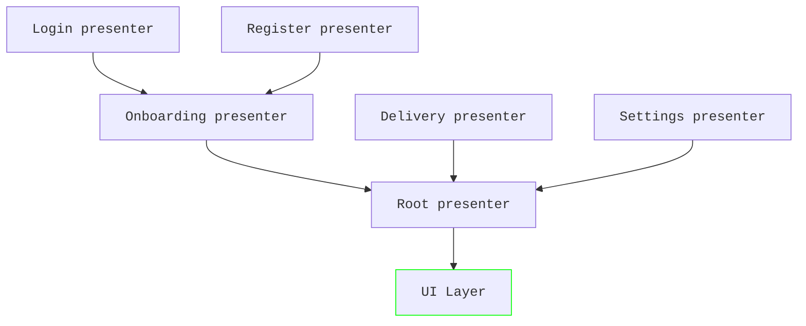

# Presenter

!!! note

    While App Platform has a generic `Presenter` interface to remove coupling, we strongly recommend using
    `MoleculePresenter` for implementations. `MoleculePresenters` are an opt-in feature through the Gradle DSL.
    The default value is `false`.

    ```groovy
    appPlatform {
      enableMoleculePresenters true
    }
    ```

## Unidirectional dataflow

App Platform implements the unidirectional dataflow pattern to decouple business logic from UI rendering. Not only
does this allow for better testing of business logic and provides clear boundaries, but individual apps can also
share more code and change the look and feel when needed.

## `MoleculePresenter`

In the unidirectional dataflow pattern events and state only travel into one direction through a single stream.
State is produced by `Presenters` and can be observed through a reactive stream:

```kotlin
interface Presenter<ModelT : BaseModel> {
  val model: StateFlow<ModelT>
}
```

`Presenters` can be implemented in many ways as long as they can be converted to this interface. App Platform
provides and recommends the implementation using [Molecule](https://github.com/cashapp/molecule) since it provides
many advantages. Molecule is a library that turns a `@Composable` function into a `StateFlow`. It leverages the
core of [Compose](https://developer.android.com/compose) without bringing in Compose UI as dependency. The primary
use case of Compose is handling, creating and modifying tree-like data structures, which is a natural fit for
UI frameworks. Molecule reuses Compose to handle state management and state transitions to implement business
logic in the form of `@Composable` functions with all the benefits that Compose provides.

The [MoleculePresenter](https://github.com/amzn/app-platform/blob/main/presenter-molecule/public/src/commonMain/kotlin/software/amazon/app/platform/presenter/molecule/MoleculePresenter.kt)
interface looks like this:

```kotlin
interface MoleculePresenter<InputT : Any, ModelT : BaseModel> {
  @Composable
  fun present(input: InputT): ModelT
}
```

[`Models`](https://github.com/amzn/app-platform/blob/main/presenter/public/src/commonMain/kotlin/software/amazon/app/platform/presenter/BaseModel.kt)
represent the state of a `Presenter`. Usually, they’re implemented as immutable, inner data classes of the `Presenter`.
Using sealed hierarchies is a good practice to allow to differentiate between different states:

```kotlin
interface LoginPresenter : MoleculePresenter<Model> {
  sealed interface Model : BaseModel {
    data object LoggedOut : Model

    data class LoggedIn(
      val user: User,
    ) : Model
  }
}
```

Notice that it’s recommended even for `Presenters` to follow the dependency inversion principle. `LoginPresenter` is
an interface and there can be multiple implementations.

??? example "Sample"

    The sample application follows the same principle of dependency inversion. E.g. the API of the
    [`LoginPresenter`](https://github.com/amzn/app-platform/blob/main/sample/login/public/src/commonMain/kotlin/software/amazon/app/platform/sample/login/LoginPresenter.kt)
    is part of the `:public` module, while the implementation [`LoginPresenterImpl`](https://github.com/amzn/app-platform/blob/main/sample/login/impl/src/commonMain/kotlin/software/amazon/app/platform/sample/login/LoginPresenterImpl.kt)
    lives in the `:impl` module. This abstraction is used in tests, where [`FakeLoginPresenter`](https://github.com/amzn/app-platform/blob/main/sample/navigation/impl/src/commonTest/kotlin/software/amazon/app/platform/sample/navigation/NavigationPresenterImplTest.kt#L45-L49)
    simplifies the test setup of classes relying on `LoginPresenter`.

Observers of the state of a `Presenter`, such as the UI layer, communicate back to the `Presenter` through events.
Events are sent through a lambda in the `Model`, which the `Presenter` must provide:

```kotlin hl_lines="16"
interface LoginPresenter : MoleculePresenter<Unit, Model> {

  sealed interface Event {
    data object Logout : Event

    data class ChangeName(
      val newName: String,
    ) : Event
  }

  sealed interface Model : BaseModel {
    data object LoggedOut : Model

    data class LoggedIn(
      val user: User,
      val onEvent: (Event) -> Unit,
    ) : Model
  }
}
```

A concrete implementation of `LoginPresenter` could look like this:

```kotlin
@Inject
@ContributesBinding(AppScope::class)
class AmazonLoginPresenter : LoginPresenter {
  @Composable
  fun present(input: Unit): Model {
    ..
    return if (user != null) {
      LoggedIn(user = user) { event ->
        when (event) {
          is Logout -> ..
          is ChangeName -> ..
        }
      }
    } else {
      LoggedOut
    }
  }
}
```

!!! note

    `MoleculePresenters` are never singletons. While they use `kotlin-inject-anvil` for constructor injection and
    automatically bind the concrete implementation to an API using `@ContributesBinding`, they don't use the
    `@SingleIn` annotation. `MoleculePresenters` manage their state in the `@Composable` function with the Compose
    runtime. Therefore, it's strongly discouraged to have any class properties.

## Model driven navigation

`Presenters` are composable, meaning that one presenter could combine N other presenters into a single stream of
model objects. With that concept in mind we can decompose large presenters into multiple smaller ones. Not only
do they become easier to change, maintain and test, but we can also share and reuse presenters between multiple
screens if needed. Presenters form a tree with nested presenters. They’re unaware of their parent and communicate
upwards only through their `Model`.

```kotlin hl_lines="14 17"
class OnboardingPresenterImpl(
  // Make presenters lazy to only instantiate them when they're actually needed.
  private val lazyLoginPresenter: () -> LoginPresenter,
  private val lazyRegistrationPresenter: () -> RegistrationPresenter,
) : OnboardingPresenter {

  @Composable
  fun present(input: Unit): BaseModel {
    ...
    return if (mustRegister) {
      // Remember the presenter to avoid creating a new one during each
      // composition (in other words when computing a new model).
      val registrationPresenter = remember { lazyRegistrationPresenter() }
      registrationPresenter.present(Unit)
    } else {
      val loginPresenter = remember { lazyLoginPresenter() }
      loginPresenter.present(Unit)
    }
  }
}
```

Notice how the parent presenter calls the `@Composable` `present()` function from the child presenters like
a regular function to compute their model and return it.

??? example "Sample"

    [`NavigationPresenterImpl`](https://github.com/amzn/app-platform/blob/main/sample/navigation/impl/src/commonMain/kotlin/software/amazon/app/platform/sample/navigation/NavigationPresenterImpl.kt)
    is another example that highlights this principle.

    [`UserPagePresenterImpl`](https://github.com/amzn/app-platform/blob/main/sample/user/impl/src/commonMain/kotlin/software/amazon/app/platform/sample/user/UserPagePresenterImpl.kt)
    goes a step further. Its `BaseModel` is composed of two sub-models. The `listModel` is even an input for the
    detail-presenter.

    ```kotlin
    val listModel = userPageListPresenter.present(UserPageListPresenter.Input(user))
    return Model(
      listModel = listModel,
      detailModel =
        userPageDetailPresenter.present(
          UserPageDetailPresenter.Input(user, selectedAttribute = listModel.selectedIndex)
        ),
    )
    ```

This concept allows us to implement model-driven navigation. By driving the entire UI layer through `Presenters` and
emitted `Models` navigation becomes a first class API and testable. Imagine having a root presenter implementing a
back stack that forwards the model of the top most presenter. When the user navigates to a new screen, then the
root presenter would add a new presenter to the stack and provide its model object.



In the example above, the root presenter would forward the model of the onboarding, delivery or settings presenter
to the UI layer. The onboarding presenter as shown in the code example can either call the login or registration
presenter based on a condition. With Molecule calling a child presenter is as easy as invoking a function.

## Parent child communication

While the pattern isn’t used frequently, parent presenters can provide input to their child presenters. The
returned model from the child presenter can be used further to change the control flow.

```kotlin
interface ChildPresenter : MoleculePresenter<Input, Model> {
  data class Input(
    val argument: String,
  )
}

class ParentPresenterImpl(
  private val lazyChildPresenter: () -> ChildPresenter
) : ParentPresenter {

  @Composable
  fun present(input: Unit) {
    val childPresenter = remember { lazyChildPresenter() }
    val childModel = childPresenter.present(Input(argument = "abc"))

    return if (childModel...) ...
  }
}
```

This mechanism is favored less, because it only allows for direct parent to child presenter interactions and
becomes hard to manage for deeply nested hierarchies. More often a service object is injected instead, which
is used by the multiple presenters:

```kotlin hl_lines="8 12 20 25 28"
interface AccountManager {
  val currentAccount: StateFlow<Account>

  fun mustRegister(): Boolean
}

class AmazonLoginPresenter(
  private val accountManager: AccountManager
): LoginPresenter {
  @Composable
  fun present(input: Unit): Model {
    val account by accountManager.currentAccount.collectAsState()
    ...
  }
}

class OnboardingPresenterImpl(
  private val lazyLoginPresenter: () -> LoginPresenter,
  private val lazyRegistrationPresenter: () -> RegistrationPresenter,
  private val accountManager: AccountManager,
) : OnboardingPresenter {

  @Composable
  fun present(input: Unit): BaseModel {
    val account by accountManager.currentAccount.collectAsState()
    ...

    return if (accountManager.mustRegister()) {
      val registrationPresenter = remember { lazyRegistrationPresenter() }
      registrationPresenter.present(Unit)
    } else {
      val loginPresenter = remember { lazyLoginPresenter() }
      loginPresenter.present(Unit)
    }
  }
}
```

This example shows how `AccountManager` holds state and is injected into multiple presenters instead of relying
on presenter inputs.

## Launching

`MoleculePresenters` can inject other presenters and call their `present()` function inline. If you are already in a
composable UI context, then you can simply call the presenter to compute the model:

```kotlin
fun mainViewController(): UIViewController = ComposeUIViewController {
  val presenter = remember { LoginPresenter() }
  val model = presenter.present(Unit)
  ...
}
```

In this example the `LoginPresenter` model is computed from an iOS Compose Multiplatform function.

In other scenarios a composable context may not be available and it's necessary to turn the `@Composable` functions
into a `StateFlow` for consumption.

[`MoleculeScope`](https://github.com/amzn/app-platform/blob/main/presenter-molecule/public/src/commonMain/kotlin/software/amazon/app/platform/presenter/molecule/MoleculeScope.kt)
helps to turn a `MoleculePresenter` into a `Presenter`, which then exposes a `StateFlow`:

```kotlin
val stateFlow = moleculeScope
  .launchMoleculePresenter(
    presenter = myPresenter,
    input = Unit,
  )
  .model
```

!!! warning

    `MoleculeScope` wraps a `CoroutineScope`. The presenter keeps running, recomposing and producing new models
    until the `MoleculeScope` is canceled. If the `MoleculeScope` is never canceled, then presenters leak and will
    cause issues later.

    Use [`MoleculeScopeFactory`](https://github.com/amzn/app-platform/blob/main/presenter-molecule/public/src/commonMain/kotlin/software/amazon/app/platform/presenter/molecule/MoleculeScopeFactory.kt)
    to create a new `MoleculeScope` instance and call `cancel()` when you don't need it anymore.

    On Android an implementation using `ViewModels` may look like this:

    ```kotlin
    class MainActivityViewModel(
      moleculeScopeFactory: MoleculeScopeFactory,
      myPresenter: MyPresenter,
    ) : ViewModel() {

      private val moleculeScope = moleculeScopeFactory.createMoleculeScope()

      // Expose the models for consumption.
      val models = moleculeScope
        .launchMoleculePresenter(
          presenter = myPresenter,
          input = Unit
        )
        .models

      override fun onCleared() {
        moleculeScope.cancel()
      }
    }
    ```

!!! info

    By default `MoleculeScope` uses the main thread for running presenters and
    [`RecompositionMode.ContextClock`](https://github.com/cashapp/molecule/blob/trunk/molecule-runtime/src/commonMain/kotlin/app/cash/molecule/RecompositionMode.kt),
    meaning a new model is produced only once per UI frame and further changes are conflated.

    This behavior can be changed by creating a custom `MoleculeScope`, e.g. tests make use of this:

    ```kotlin
    fun TestScope.moleculeScope(
      coroutineContext: CoroutineContext = EmptyCoroutineContext
    ): MoleculeScope {
      val scope = backgroundScope + CoroutineName("TestMoleculeScope") + coroutineContext

      return MoleculeScope(scope, RecompositionMode.Immediate)
    }
    ```

## Testing

A [`test()`](https://github.com/amzn/app-platform/blob/main/presenter-molecule/testing/src/commonMain/kotlin/software/amazon/app/platform/presenter/molecule/TestPresenter.kt)
utility function is provided to make testing `MoleculePresenters` easy using the [Turbine](https://github.com/cashapp/turbine/)
library:

```kotlin
class LoginPresenterImplTest {

  @Test
  fun `after 1 second the user is logged in after pressing the login button`() = runTest {
    val userManager = FakeUserManager()

    LoginPresenterImpl(userManager).test(this) {
      val firstModel = awaitItem()
      ...
    }
  }
}
```

The `test()` function uses the `TestScope.backgroundScope` to run the presenter.

??? example "Sample"

    The sample application implements multiple tests for its presenters, e.g.
    [`LoginPresenterImplTest`](https://github.com/amzn/app-platform/blob/main/sample/login/impl/src/commonTest/kotlin/software/amazon/app/platform/sample/login/LoginPresenterImplTest.kt),
    [`NavigationPresenterImplTest`](https://github.com/amzn/app-platform/blob/main/sample/navigation/impl/src/commonTest/kotlin/software/amazon/app/platform/sample/navigation/NavigationPresenterImplTest.kt)
    and [`UserPagePresenterImplTest`](https://github.com/amzn/app-platform/blob/main/sample/user/impl/src/commonTest/kotlin/software/amazon/app/platform/sample/user/UserPagePresenterImplTest.kt).

## Compose runtime

One of the major benefits of using Compose through Molecule is how the framework turns reactive streams such as
`Flow` and `StateFlow` into imperative code, which then becomes easier to understand, write and maintain.
Composable functions have a lifecycle, they enter a composition (the presenter starts to be used) and leave
a composition (the presenter is no longer used). Properties can be made reactive and trigger creating a
new `Model` whenever they change.

### Lifecycle

This example contains two child presenters:

```kotlin
class OnboardingPresenterImpl(
  private val lazyLoginPresenter: () -> LoginPresenter,
  private val lazyRegistrationPresenter: () -> RegistrationPresenter,
) : OnboardingPresenter {

  @Composable
  fun present(input: Unit): BaseModel {
    ...
    return if (mustRegister) {
      val registrationPresenter = remember { lazyRegistrationPresenter() }
      registrationPresenter.present(Unit)
    } else {
      val loginPresenter = remember { lazyLoginPresenter() }
      loginPresenter.present(Unit)
    }
  }
}
```

On the first composition, when `OnboardingPresenterImpl.present()` is called for the first time, the lifecycle of
`OnboardingPresenterImpl` starts. Let’s assume `mustRegister` is true, then `RegistrationPresenter` gets called
and its lifecycle starts as well. In the example when `mustRegister` switches to false, then `RegistrationPresenter`
leaves the composition and its lifecycle ends. `LoginPresenter` enters the composition and its lifecycle starts.
If the parent presenter of `OnboardingPresenterImpl` stops calling this presenter, then `OnboardingPresenterImpl`
and `LoginPresenter` would leave composition and both of their lifecycles end.

### State

[Google’s guide](https://developer.android.com/develop/ui/compose/state) for state management is a good starting
point. APIs most often used are [`remember()`](https://developer.android.com/reference/kotlin/androidx/compose/runtime/package-summary#remember(kotlin.Function0)),
[`mutableStateOf()`](https://developer.android.com/reference/kotlin/androidx/compose/runtime/package-summary#mutableStateOf(kotlin.Any,androidx.compose.runtime.SnapshotMutationPolicy)),
[`collectAsState()`](https://developer.android.com/reference/kotlin/androidx/compose/runtime/package-summary#(kotlinx.coroutines.flow.StateFlow).collectAsState(kotlin.coroutines.CoroutineContext))
and [`produceState()`](https://developer.android.com/reference/kotlin/androidx/compose/runtime/package-summary#produceState(kotlin.Any,kotlin.coroutines.SuspendFunction1)).

```kotlin
@Composable
fun present(input: Unit): Model {
  var toggled: Boolean by remember { mutableStateOf(false) }

  return Model(
    text = if (toggled) "toggled" else "not toggled",
  ) {
    when (it) {
      is ToggleClicked -> toggled = !toggled
    }
  }
}
```

In this example, whenever the Presenter receives the `ToggleClicked` event, then the state `toggled` changes.
This triggers a recomposition in the Compose runtime and will call `present()` again to compute a new `Model`.

`Flows` can easily be observed using `collectAsState()`:

```kotlin hl_lines="10"
interface AccountManager {
  val currentAccount: StateFlow<Account>
}

class AmazonLoginPresenter(
  private val accountManager: AccountManager
): LoginPresenter {
  @Composable
  fun present(input: Unit): Model {
    val account: Account by accountManager.currentAccount.collectAsState()
    ...
  }
}
```

Whenever the `currentAccount` Flow emits a new `Account`, then the Compose runtime will trigger a recomposition
and a new `Model` will be computed.

### Side effects

It’s recommended to read [Google’s guide](https://developer.android.com/jetpack/compose/side-effects). Since
composable functions come with a lifecycle, async operations can safely be launched and get automatically torn
down when the `Presenter` leaves the composition. Commonly used APIs are
[`LaunchedEffect()`](https://developer.android.com/reference/kotlin/androidx/compose/runtime/package-summary#LaunchedEffect(kotlin.Any,kotlin.coroutines.SuspendFunction1)),
[`DisposableEffect()`](https://developer.android.com/reference/kotlin/androidx/compose/runtime/package-summary#DisposableEffect(kotlin.Any,kotlin.Function1))
and [`rememberCoroutineScope()`](https://developer.android.com/reference/kotlin/androidx/compose/runtime/package-summary#rememberCoroutineScope(kotlin.Function0)).

```kotlin
@Composable
fun present(input: Unit): Model {
  LaunchedEffect(key) {
    // This is within a CoroutineScope and suspending functions can
    // be called:
    flowOf(1, 2, 3).collect { ... }
  }
}
```

If the `key` changes between compositions, then a new coroutine is launched and the previous one canceled. For more
details see [here](https://developer.android.com/jetpack/compose/side-effects#launchedeffect).

This is an example for how one would use `rememberCoroutineScope()`:

```kotlin
@Composable
fun present(input: Unit): Model {
  val coroutineScope = rememberCoroutineScope()

  return Model() {
    when (it) {
      is OnClick -> coroutineScope.launch { ... }
    }
  }
}
```

When the `Presenter` leaves composition, then all jobs launched by this coroutine scope get canceled. For more
details see [here](https://developer.android.com/jetpack/compose/side-effects#remembercoroutinescope).

## Recipes

There are common scenarios you may encounter when using `Presenters`.

### Back gestures

`Presenters` support back gestures with a similar API in terms of syntax and semantic to Compose Multiplatform. Any
`Presenter` can call these functions:

```kotlin
@Composable
fun present(input: Unit): Model {
  BackHandlerPresenter {
    // Handle a back press.  
  }

  PredictiveBackHandlerPresenter { progress: Flow<BackEventCompat> ->
    // code for gesture back started
    try {
      progress.collect { backevent ->
        // code for progress
      }
      // code for completion
    } catch (e: CancellationException) {
      // code for cancellation
    }
  }  
}
```

!!! warning

    Notice `Presenter` suffix in these function names. These functions should not be confused with `BackHandler {}` and
    `PredictiveBackHandler` coming from Compose Multiplatform or Compose UI Android, which would fail at runtime when
    called from a `Presenter`.

Calling these functions requires `BackGestureDispatcherPresenter` to be setup as composition local. This is usually 
done in from the root presenter of your hierarchy. An instance of `BackGestureDispatcherPresenter` is provided by App
Platform in the application scope and can be injected:

```kotlin hl_lines="3 7 8 9"
@Inject
class RootPresenter(
  private val backGestureDispatcherPresenter: BackGestureDispatcherPresenter,
) : MoleculePresenter<Unit, Model> {
  @Composable
  override fun present(input: Unit): Model {
    return returningCompositionLocalProvider(
      LocalBackGestureDispatcherPresenter provides backGestureDispatcherPresenter
    ) {
      // Call other child presenters.
    }
  }
}
```

The last step is to forward back gestures from the UI layer to `Presenters` to invoke the callbacks in the 
`Presenters`. Here again it's recommended to do this in from the root `Renderer`:

```kotlin hl_lines="4 8"
@Inject
@ContributesRenderer
class RootPresenterRenderer(
  private val backGestureDispatcherPresenter: BackGestureDispatcherPresenter,
) : ComposeRenderer<Model>() {
  @Composable
  override fun Compose(model: Model) {
    backGestureDispatcherPresenter.ForwardBackPressEventsToPresenters()

    // Call other child renderers.
  }
}
```

A similar built-in integration is provided for Android Views. There it's recommended to call this function from each
Android `Activity`:

```kotlin hl_lines="8 12 20 25 28"
class MainActivity : ComponentActivity() {

  override fun onCreate(savedInstanceState: Bundle?) {
    super.onCreate(savedInstanceState)

    backGestureDispatcherPresenter.forwardBackPressEventsToPresenters(this)
    // ...
  }
}
```

Unit tests verifying the behavior of a `Presenter` using the back handler APIs need to provide the composition local
as well. This can be achieved by wrapping the `Presenter` with `withBackGestureDispatcher()`:

```kotlin
class MyPresenterTest {

  @Test
  fun `test back handler`() = runTest {
    val presenter = MyPresenter()

    presenter.withBackGestureDispatcher().test(this) {
      // Verify the produced models from the presenter.
    }
  }
}
```

??? example "Sample"

    The `BackHandlerPresetner {}` call has been integrated in the sample application with this recommended setup. All
    necessary changes are part of this [commit](https://github.com/amzn/app-platform/pull/84/commits/a807a5673973eae26940cd1130dad836cb3dbd43).

    The same setup has been integrated in the recipes app part of this [commit](https://github.com/amzn/app-platform/pull/82/commits/fce1b3fbc0b2683ec6a93a499694f914bac34b18)
    as well. 
