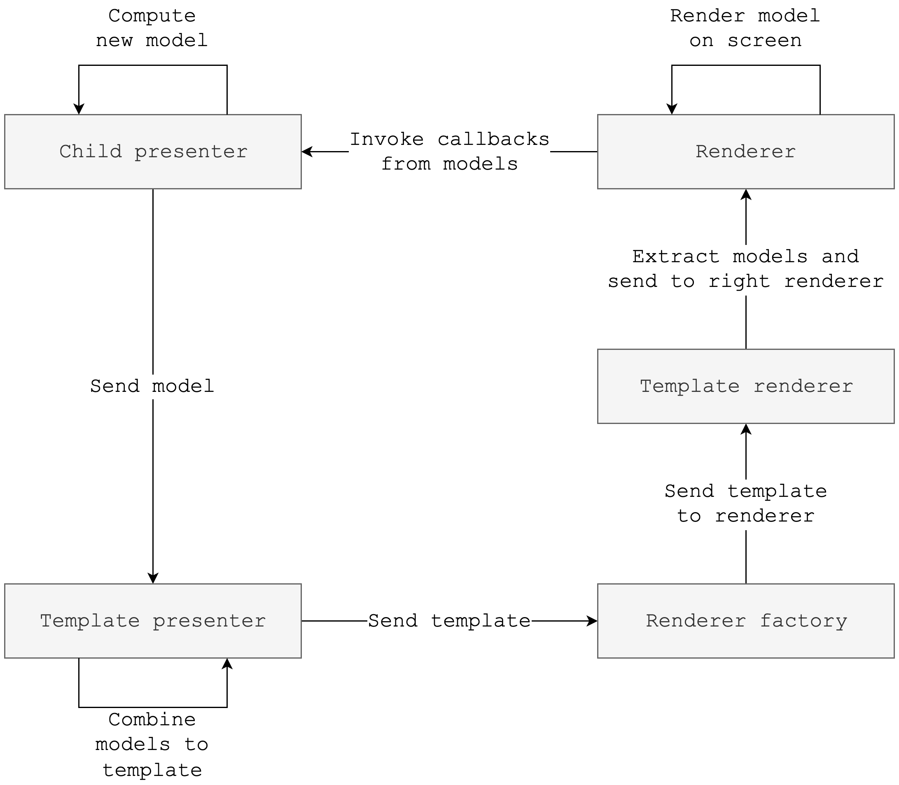

# Template

[`Templates`](https://github.com/amzn/app-platform/blob/main/presenter/public/src/commonMain/kotlin/software/amazon/app/platform/presenter/template/Template.kt)
are an abstraction between `Presenters` and `Renderers` and represent the root of the presenter and renderer tree.
Practically, a template is one particular type of `BaseModel` that hosts other models (a container of models).
However, instead of using a weak type like `List<BaseModel>`, a template carries semantics about what content should
be rendered, how many UI layers there are and where each individual model should be displayed.

`Templates` are app specific and not shared, because each app may use a different layering mechanism for individual
screen configurations. An example template definition could look like this:

```kotlin
sealed interface SampleAppTemplate : Template {

  data class FullScreenTemplate(
    val model: BaseModel,
  ) : SampleAppTemplate

  data class ListDetailTemplate(
    val list: BaseModel,
    val detail: BaseModel,
  ) : SampleAppTemplate
}
```

??? example "Sample"

    A [similar hierarchy](https://github.com/amzn/app-platform/blob/main/sample/templates/public/src/commonMain/kotlin/software/amazon/app/platform/sample/template/SampleAppTemplate.kt)
    is implemented in the sample application.

The `Template` interface extends `BaseModel` and each app must come with its own `TemplatePresenter` and
`TemplateRenderer`. Both are implemented the same way as other presenters and renderers would be implemented.
The responsibility of the `TemplatePresenter` is to wrap another presenter and wrap its models within a `Template`,
e.g.

```kotlin hl_lines="8"
@Inject
class SampleAppTemplatePresenter(
  @Assisted private val rootPresenter: MoleculePresenter<Unit, *>,
) : MoleculePresenter<Unit, SampleAppTemplate> {
  @Composable
  override fun present(input: Unit): SampleAppTemplate {
    return returningCompositionLocalProvider {
      rootPresenter.present(Unit).toTemplate {
        SampleAppTemplate.FullScreenTemplate(it)
      }
    }
  }
}
```

??? example "Sample"

    The sample app has a [similar implementation](https://github.com/amzn/app-platform/blob/main/sample/templates/public/src/commonMain/kotlin/software/amazon/app/platform/sample/template/SampleAppTemplatePresenter.kt).

The wrapped presenter can override which `Template` to use by implementing [`ModelDelegate`](https://github.com/amzn/app-platform/blob/main/presenter/public/src/commonMain/kotlin/software/amazon/app/platform/presenter/template/ModelDelegate.kt),
e.g.

```kotlin
data class Model(
  ...
) : BaseModel, ModelDelegate {
  override fun delegate(): BaseModel = ListDetailTemplate(...)
}
```

??? example "Sample"

    The sample app makes use of this mechanism in the [user page](https://github.com/amzn/app-platform/blob/main/sample/user/public/src/commonMain/kotlin/software/amazon/app/platform/sample/user/UserPagePresenter.kt),
    where it the layout is split between a list presenter / renderer and detail presenter / renderer.

    ```kotlin
    data class Model(
      val listModel: BaseModel,
      val detailModel: BaseModel
    ) : BaseModel, ModelDelegate {
      override fun delegate(): BaseModel {
        return SampleAppTemplate.ListDetailTemplate(listModel, detailModel)
      }
    }
    ```

The `TemplateRenderer` receives the specific `Template`, lays out necessary containers and renders individual
models in these layers. The renderer often injects `RendererFactory` to create renderers for the models, e.g.

```kotlin
@Inject
@ContributesRenderer
class ComposeSampleAppTemplateRenderer(
  private val rendererFactory: RendererFactory
) : ComposeRenderer<SampleAppTemplate>() {

  @Composable
  override fun Compose(model: SampleAppTemplate) {
    when (model) {
      is SampleAppTemplate.FullScreenTemplate -> FullScreen(model)
      is SampleAppTemplate.ListDetailTemplate -> ListDetail(model)
    }
  }

  @Composable
  private fun FullScreen(template: SampleAppTemplate.FullScreenTemplate) {
    val renderer = rendererFactory.getComposeRenderer(template.model)
    renderer.renderCompose(template.model)
  }

  @Composable
  private fun ListDetail(template: SampleAppTemplate.ListDetailTemplate) {
    Row {
      Column {
        rendererFactory.getComposeRenderer(template.list).renderCompose(template.list)
      }
      Column {
        rendererFactory.getComposeRenderer(template.detail).renderCompose(template.detail)
      }
    }
  }
}
```

### Consuming `Templates`

On the API level `Templates` are regular `Models`, with a regular `Presenter` and `Renderer`. Therefore, they
require no special treatment and the regular `RendererFactory` can be used:

```kotlin
fun mainViewController(rootScopeProvider: RootScopeProvider): UIViewController =
  ComposeUIViewController {
    val factory = remember { ComposeRendererFactory(rootScopeProvider = rootScopeProvider) }

    val templatePresenter = remember {
      val component = rootScopeProvider.rootScope.kotlinInjectComponent<ViewControllerComponent>()
      component.factory.createSampleAppTemplatePresenter(component.navigationPresenter)
    }

    val template = templatePresenter.present(Unit)
    factory.getComposeRenderer(template).renderCompose(template)
  }

@ContributesTo(AppScope::class)
interface ViewControllerComponent {
  val factory: SampleAppTemplatePresenter.Factory
  val navigationPresenter: NavigationPresenter
}
```

## Unidirectional dataflow

Templates complete the circle in our unidirectional dataflow pattern:

{ width="600" }

This diagram summarizes how models from child presenters bubble up ultimately to the template presenter. The template
presenter wraps the models in a template, which is then handed off the rendering pipeline. `RendererFactory` finds
the right renderers for the template and models and the content will be shown on screen by individual renderers. The
circle repeats either when a renderer invokes a callback from the model and sends the event back to the presenter or
another state change occurs within the the presenter tree.
