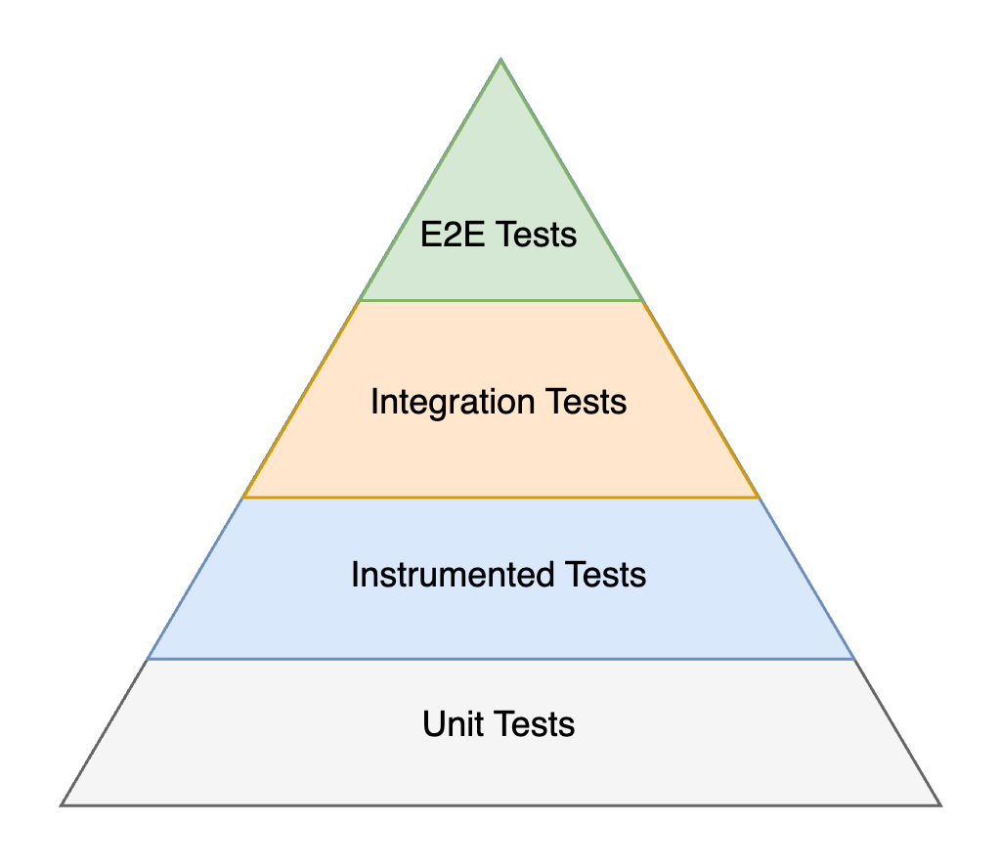

# Testing

A fundamental design pattern to make testing effective is dependency inversion, which means that high-level
APIs don’t depend on low-level details and low-level details only import other high-level APIs.
It significantly reduces coupling between components.

App Platform implements the pattern in its [module structure](module-structure.md#gradle-modules) and in
[Kotlin code](module-structure.md#kotlin-code). By relying on dependency inversion, we decouple projects from
their dependencies and enable testing in isolation. This approach is important for unit tests, instrumented tested
and integration tests. These three types of tests rely on a chain of trust, where we assume that dependencies
are functioning and tests don’t need to be repeated.

{ width="400" }

!!! info "Instrumented tests"

    The sample application implements instrumented tests for two screens and navigates between the tests. The
    [tests for Desktop](https://github.com/amzn/app-platform/blob/main/sample/app/src/desktopTest/kotlin/software/amazon/app/platform/sample/LoginUiTest.kt)
    highlight how templates are rendered and robots are used for verification. It also sets up a `kotlin-inject-anvil`
    [`TestAppComponent`](https://github.com/amzn/app-platform/blob/main/sample/app/src/desktopTest/kotlin/software/amazon/app/platform/sample/TestDesktopAppComponent.kt),
    which replaces the main `AppComponent`.

    The same UI test is [implemented for Android](https://github.com/amzn/app-platform/blob/main/sample/app/src/androidInstrumentedTest/kotlin/software/amazon/app/platform/sample/AndroidLoginUiTest.kt).
    The Android tests reuse the same robots for verification and set up a
    [`TestAppComponent`](https://github.com/amzn/app-platform/blob/main/sample/app/src/androidInstrumentedTest/kotlin/software/amazon/app/platform/sample/TestAndroidAppComponent.kt)
    in a similar way.

## Fakes

Unit tests build the foundation of the testing pyramid. They verify the smallest components of our app, which
usually are single classes or functions and we rarely test multiple classes in combination. Dependencies of
these classes are typically replaced by fakes. Due to this low coupling unit tests tend to be very stable.

!!! info "Fakes vs real implementations"

    Using real implementations of dependencies for the unit under test is a valid option as it brings the
    tested code close to production, increases confidence and removes isolation.
    A [best practice from Google](https://abseil.io/resources/swe-book/html/ch13.html) is summarized as:

    > A real implementation is preferred if it is fast, deterministic, and has simple dependencies. For example,
    > a real implementation should be used for a value object. Examples include an amount of money, a date, a
    > geographical address, or a collection class such as a list or a map.
    >
    > However, for more complex code, using a real implementation often isn’t feasible. There might not be an
    > exact answer on when to use a real implementation or a test double given that there are trade-offs to be made.

    The trade-offs include execution time, determinism and dependency construction. Fakes improve all three points
    by avoiding slow IO, returning stable results and breaking dependency chains at the cost of diverging from the
    behavior in production and reduced confidence.

```kotlin
interface LocationProvider {
  val location: StateFlow<Location>
}

class RoutingRepository(
  private val locationProvider: LocationProvider
)
```

Imagine to test `RoutingRepository`. To create an new instance under test, we must provide a `LocationProvider`.
Since we use dependency inversion and didn’t hardcode a concrete implementation, it is simple to implement a fake
for this interface:

```kotlin
class FakeLocationProvider(
  val currentLocation: Location = Location(..)
) : LocationProvider {
  private val _location = MutableStateFlow(currentLocation)
  override val location = _location

  fun updateLocation(newLocation: Location) {
    _location.value = newLocation
  }
}
```

Now we can instantiate our `RoutingRepository`:

```kotlin
@Test
fun `the route is updated when the driver doesn't follow directions`() {
  val locationProvider = FakeLocationProvider()
  val routingRepository = RoutingRepository(locationProvider)

  locationProvider.updateLocation(...)
}
```

Good fake implementations are valuable. It’s best practice and strongly encouraged as an API provider to implement
fakes for APIs and share them with consumers. The [App Platform module structure](module-structure.md) provides
[`:testing` modules](module-structure.md#testing) for this purpose. For example, the owner of `LocationProvider`
is encouraged to use this structure:

```
:location-provider:public   src/commonMain/kotlin/.../LocationProvider.kt
:location-provider:testing  src/commonMain/kotlin/.../FakeLocationProvider.kt
```

The owner of `RoutingRepository` can import `:location-provider:testing` and reuse the provided fake in tests.
This avoids duplication.

??? example "Sample"

    The sample app uses `:testing` modules to implement and share fakes across modules, e.g.
    [`:sample:user:testing`](https://github.com/amzn/app-platform/tree/main/sample/user/testing). In other modules
    fakes are created next to the tests ad-hoc, e.g. [`FakeUserPagePresenter`](https://github.com/amzn/app-platform/blob/0f3e242ae08bb242fbd7080d33caa069c8fae2b4/sample/navigation/impl/src/commonTest/kotlin/software/amazon/app/platform/sample/navigation/NavigationPresenterImplTest.kt#L51-L58)
    and [`FakeAnimationHelper`](https://github.com/amzn/app-platform/blob/main/sample/user/impl/src/commonTest/kotlin/software/amazon/app/platform/sample/user/FakeAnimationHelper.kt).

    ```kotlin
    private class FakeUserPagePresenter : UserPagePresenter {
      @Composable
      override fun present(input: Unit): UserPagePresenter.Model =
        UserPagePresenter.Model(
          listModel = object : BaseModel {},
          detailModel = object : BaseModel {},
        )
    }
    ```

    ```kotlin
    object FakeAnimationHelper : AnimationHelper {
      override fun isAnimationsEnabled(): Boolean = true
    }
    ```

## Robots

Test [`Robots`](https://jakewharton.com/testing-robots/) are an abstraction between test interactions and the
underlying implementation. Imagine several tests clicking the *Logout* button use the label to find the UI element
on the screen. If the copy changes from *Logout* to *Sign out*, then all these tests would need to be updated.
That is tedious and makes tests harder to maintain. A test robot would hide how the *Logout* button can be found
on screen and only provides an option for the necessary interaction:

```kotlin
class LogoutRobot : Robot {
  fun clickLogoutButton() { .. }
}
```

Test [`Robots`](https://github.com/amzn/app-platform/blob/main/robot/public/src/commonMain/kotlin/software/amazon/app/platform/robot/Robot.kt)
are not limited to UI interactions such as verifying UI elements are shown or hidden and invoking
actions on them. They can also be used to change fake implementations or make assertions on them. Imagine a
robot toggling network connectivity. Tests do not interact with fake implementations directly similar to them
not interacting with UI elements directly.

```kotlin
class NetworkRobot : Robot {
  var networkEnabled: Boolean
  var connectivity: Connectivity

  var throwErrorOnSendingRequest: Boolean = false

  enum class Connectivity {
    LTE, 3G, WIFI, ...
  }
}
```

Another use case is verifying metrics and analytics events. In instrumented tests we’d use a fake metrics
implementation rather than sending events to our backend system. The robot would interact with the fake
implementation and make assertions:

```kotlin
class FakeMetricsService : MetricsService {
  val metrics: List<Metric>
}

class MetricsRobot : Robot {
  private val service: FakeMetricsService ...

  fun assertMetricTracked(metric: Metric) {
    assertThat(service.metrics).contains(metric)
  }
}
```

Fake implementations and test robots help verifying interactions with hardware or devices that are not available
during an instrumented test run. For example, interactions with other devices can be simulated using a fake
connection.

```kotlin
interface WebSocketConnection {
  suspend fun send(message: ByteArray)
}

class FakeWebSocketConnection : WebSocketConnection {
  var throwError: Boolean

  override suspend fun send(message: ByteArray) {
    if (throwError) {
      throw Exception("..."
    } else {
      trackMessage(message)
    }
  }
}

class ConnectionRobot : Robot {
  private val webSocketConnection: FakeWebSocketConnection

  fun sendingMessageFails() {
    webSocketConnection.throwError = true
  }

  fun sendingMessageSucceeds() {
    webSocketConnection.throwError = false
  }
}
```

### Robot types

[`Robot`](https://github.com/amzn/app-platform/blob/main/robot/public/src/commonMain/kotlin/software/amazon/app/platform/robot/Robot.kt).

:   Use this common interface for robots that don't interact with any UI, whether that's Compose Multiplatform or
    Android Views. To obtain an instance of such a robot use the `robot<Type>()` function:

    ```kotlin
    @Inject
    @ContributesRobot(AppScope::class)
    class MetricsRobot(
      private val metricsService: FakeMetricsService
    ) : Robot {
      fun assertMetricTracked(metric: Metric) {
        assertThat(metricsService.metrics).contains(metric)
      }
    }

    @Test
    fun verify_analytics_event_tracked() {
      ...
      robot<MetricsRobot>().assertMetricTracked(..)
    }
    ```

[`ComposeRobot`](https://github.com/amzn/app-platform/blob/main/robot-compose-multiplatform/public/src/commonMain/kotlin/software/amazon/app/platform/robot/ComposeRobot.kt)

:   `ComposeRobot` should be used as parent type when the robot interacts with Compose UI elements. These robots need
    access to a `SemanticsNodeInteractionsProvider` instance, which is for example provided by calling
    `runComposeUiTest { ... }` within a test. To forward the `SemanticsNodeInteractionsProvider` instance to the robot
    call `composeRobot<Type>()` instead of `robot<Type>()`.

    !!! warning

        Calling `robot<Type>()` for a `ComposeRobot` will result in a crash. Always use `composeRobot<Type>()` instead.

    ```kotlin
    @ContributesRobot(AppScope::class)
    class LoginRobot : ComposeRobot() {

      private val loginButtonNode
        get() = compose.onNodeWithTag("loginButton")

      /** Verify that login button is displayed. */
      fun seeLoginButton() {
        loginButtonNode.assertIsDisplayed()
      }

      /** Clicks the login button and starts the login process. */
      fun clickLoginButton() {
        loginButtonNode.performClick()
      }
    }

    @Test
    fun `sample test`() {
      runComposeUiTest {
        composeRobot<LoginRobot> {
          seeLoginButton()
          clickLoginButton()
        }
      }
    }
    ```

[`AndroidViewRobot`](https://github.com/amzn/app-platform/blob/main/robot/public/src/androidMain/kotlin/software/amazon/app/platform/robot/AndroidViewRobot.kt)

:   `AndroidViewRobot` should be used as parent type when the robot interacts with Android Views.
    To obtain an instance of such a robot use the `robot<Type>()` function:

    ```kotlin
    @ContributesRobot(AppScope::class)
    class AndroidCounterRobot : AndroidViewRobot() {
      fun seeCounterView() {
        onView(withText(containsString("Counter: "))).check(matches(isDisplayed()))
      }
    }

    @Test
    fun counter_is_shown() {
      robot<AndroidCounterRobot> {
        seeCounterView()
      }
    }
    ```

`Robots` must be annotated with `@ContributesRobot` in order to find them during tests when using the `robot<Type>()`
or `composeRobot<Type>()` function. The annotation makes sure that the robots are added to the `kotlin-inject-anvil`
dependency graph.

??? info "Generated code"

    The `@ContributesRobot` annotation generates following code.

    ```kotlin
    @ContributesTo(AppScope::class)
    public interface LoginRobotComponent {
      public val loginRobot: LoginRobot

      @Provides public fun provideLoginRobot(): LoginRobot = LoginRobot()

      @Provides
      @IntoMap
      public fun provideLoginRobotIntoMap(
        robot: () -> LoginRobot
      ): Pair<KClass<out Robot>, () -> Robot> = LoginRobot::class to robot
    }
    ```

If a `Robot` needs to inject other types such a fake implementations, then it needs to be additionally annotated with
`@Inject`, e.g.

```kotlin
@Inject
@ContributesRobot(AppScope::class)
class MetricsRobot(
  private val metricsService: FakeMetricsService
) : Robot {
  fun assertMetricTracked(metric: Metric) {
    assertThat(metricsService.metrics).contains(metric)
  }
}
```

### `:*-robots` modules

Similar to sharing fakes for unit tests by leveraging `:testing` modules, the module structure of App Platform
provides [`:*-robots` modules](module-structure.md#robots) to share code for instrumented tests across projects.
It’s strongly encouraged for features to create `:*-robots` modules and share robot implementations.

??? example "Sample"

    The sample application comes with two robot implementations [`LoginRobot`](https://github.com/amzn/app-platform/blob/main/sample/login/impl-robots/src/commonMain/kotlin/software/amazon/app/platform/sample/login/LoginRobot.kt)
    and [`UserPageRobot`](https://github.com/amzn/app-platform/blob/main/sample/user/impl-robots/src/commonMain/kotlin/software/amazon/app/platform/sample/user/UserPageRobot.kt),
    each living in its feature specific `:robots` module.

## Mocks

**Which mocking framework is recommended?**

None.

Mocking frameworks in general are discouraged and the downside outweigh the little conveniences they offer.
By following the principle of dependency inversion we can easily avoid using mocking frameworks and implement
fakes instead. There are many good resources available describing the advantages of fakes over mocking framework.
We recommend reading the provided resources in-order:

* [AndroidX](https://github.com/androidx/androidx/blob/acb603e0857476b17e605fd1384c1f45e7991665/docs/api_guidelines/testing.md) strongly discourages mocking frameworks and banned them from new code. This guide explains in more detail their reasoning and it resonates well.
* [Google engineers](https://abseil.io/resources/swe-book/html/ch13.html) compare test doubles and give excellent advice for how to fake dependencies (this article is longer, but it’s likely the best one available).
* [developer.android.com](https://developer.android.com/training/testing/fundamentals/test-doubles#types) prefers fakes over mocks for test doubles: “Fakes don't require a mocking framework and are lightweight. They are preferred.”
* [CashApp](https://www.billjings.net/posts/title/fakes-are-great-but-mocks-i-hate/?up=technical) banned mocking frameworks in the Android codebase, because mocks are a maintenance burden.
* [Ryan Harter](https://ryanharter.com/blog/2020/06/replacing-mocks/) calls out easy traps when using mocks.
* [Pravin Sonawane](https://medium.com/@june.pravin/mocking-is-not-practical-use-fakes-e30cc6eaaf4e) makes similar arguments and highlights how mocks encourage testing the “how” rather than focusing on the “what” (inputs and outputs).
* Google blog [Don’t overuse mocks](https://testing.googleblog.com/2013/05/testing-on-toilet-dont-overuse-mocks.html) highlights some downsides of mocks and presents real or fake implementations as alternative.


